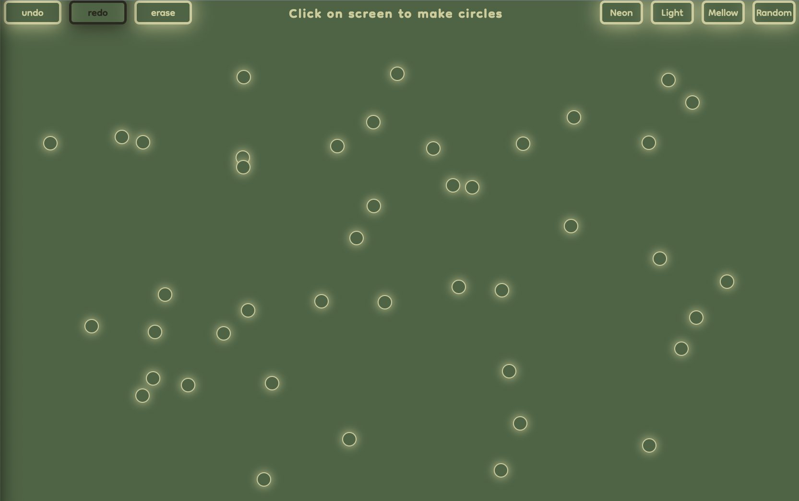

# [Circle Painter](https://circle-paint.netlify.app/)

### Preview:

### Things I learned:
  - Working with `event`
  - Creating elements infinitely on user interaction
  - Lots about CSS inheritance
  - CSS custom properties
  - `position: relative` / `position: absolute`
  - React's `useState` and `useContext`
  - Updating state with previous state values being carried over
  - How to deploy with Netlify

---

### Challenges I faced while building this:
  1. Disabling the buttons correctly
  2. Getting the new element to show at the click point
  3. How to keep track of the "undos" for the "redo"
  4. Setting up the context

---

### Tech I used:  

---

### Things I'm proud of:
* **I DID IT!!!!**
* I expected this to take me so much longer than it did
* I didn't use any sort of tutorial for this, just figured it out by researching.
* It's deployed and works as intended
  
